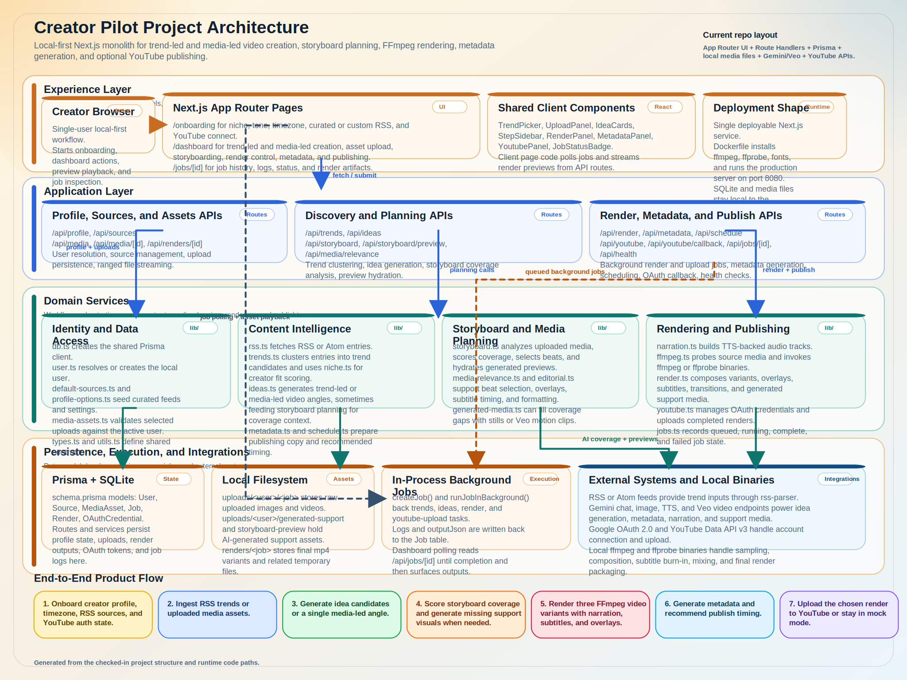

Copyright © Priyam Singhal (2026). All rights preserved.

# Creator Pilot

Creator Pilot is a local-first full-stack app for turning either live news trends or creator-uploaded media into storyboarded, narrated, render-ready videos with optional YouTube upload.

High-level pipeline:

```text
RSS trends or uploaded media
  -> idea generation
  -> storyboard coverage analysis
  -> generated support visuals/clips when needed
  -> FFmpeg render variants with subtitles and audio
  -> metadata + schedule recommendation
  -> YouTube upload
```

## Stack

- Frontend: Next.js App Router, React 19, TypeScript, Tailwind CSS 4
- Backend: Next.js Route Handlers under `app/api/*`
- Database: Prisma + SQLite
- Media pipeline: FFmpeg + ffprobe
- Trend ingest: `rss-parser`
- AI stack: Google Gemini / Veo through a mix of OpenAI-compatible and native Gemini endpoints
- Publishing: Google OAuth 2.0 + YouTube Data API v3

## Current Features

- Trend-led workflow: fetch RSS trends, select a trend, generate creator-ready ideas
- Media-led workflow: start from uploaded screenshots or clips, optionally add a brief, then derive a render-ready angle
- Storyboard planning with coverage scoring, beat selection, and media relevance checks
- Multimodal asset analysis for uploaded media, with heuristic fallback when disabled or unavailable
- Generated supporting visuals and motion clips for coverage gaps
- Narration generation, optional background music ducking, and optional transition SFX
- Three FFmpeg render variants with auto `shorts` or `landscape` format selection
- Metadata generation and publish-time recommendation
- Mock or live YouTube upload, depending on OAuth configuration
- Job tracking with persisted logs and polling UI

## System Design (Multi-Agent Architecture)



```text
Creator Workspace + Route Handlers
  /dashboard, /jobs/[id], /api/trends, /api/ideas,
  /api/storyboard, /api/render, /api/metadata, /api/youtube

        |
        v

Orchestrator Agent
  runTrendDiscoveryWorkflow()
  runIdeaWorkflow()
  runStoryboardWorkflow()
  runRenderWorkflow()
  runMetadataWorkflow()
  runPublishingWorkflow()

        |
        v

Specialized Agents
  Profile / Memory Agent
  Trend Discovery Agent
  Ideation Agent
  Media Selection Agent
  Storyboard Agent
  Render Agent
  Metadata Agent
  Publishing Agent

        |
        v

Memory + Tools + Runtime
  Prisma + SQLite (User, Source, Job, Render)
  local filesystem (/uploads, /renders)
  RSS feeds
  Gemini / Veo APIs
  FFmpeg / ffprobe
  YouTube Data API
  in-process background jobs
```

- UI and API still ship together as one Next.js service, but workflow control is now explicit in `lib/agents/orchestrator.ts`.
- Route Handlers delegate to specialized agents under `lib/agents/` instead of stitching every step inline.
- Memory is grounded in the current Prisma schema: creator profile and preferences come from `User` and `Source`, while recent outputs and publishing feedback come from `Job.outputJson` and `Render`.
- Tool usage is also grounded in current code: RSS feeds, Gemini/Veo endpoints, FFmpeg/ffprobe, the YouTube Data API, and local asset storage.
- Long-running work still runs through `lib/jobs.ts`, and the UI now reads agent-level log lines from those job records.
- The feedback loop is practical rather than invented: Publishing -> Memory -> Ideation is implemented by reading recent upload/render job outputs back into the memory snapshot for later idea generation.
- Diagram source: `npm run diagram:architecture` regenerates `docs/architecture/creator-pilot-architecture.svg` and `docs/architecture/creator-pilot-architecture.jpg`.
- Full architecture notes, gap analysis, and phased migration plan: `docs/architecture/creator-pilot-multi-agent-architecture.md`.

## Agent Model

- `Orchestrator Agent` in `lib/agents/orchestrator.ts` is the workflow controller. It owns shared workflow state and delegates to specialist agents through `runTrendDiscoveryWorkflow()`, `runIdeaWorkflow()`, `runStoryboardWorkflow()`, `runRenderWorkflow()`, `runMetadataWorkflow()`, and `runPublishingWorkflow()`.
- `Profile / Memory Agent` loads creator profile, enabled sources, recent renders, and recent publishing outputs from Prisma so later steps can use existing context instead of treating every run as stateless.
- `Trend Discovery Agent` wraps RSS source sync, feed fetch, clustering, and trend ranking. It maps directly onto the existing `lib/rss.ts`, `lib/trends.ts`, and `lib/default-sources.ts` logic.
- `Ideation Agent` wraps `lib/ideas.ts` and now receives `creatorMemorySummary`, so idea generation can reference creator preferences and recent outputs.
- `Media Selection Agent` resolves uploaded assets from IDs or stored paths before storyboarding or rendering.
- `Storyboard Agent` wraps `lib/storyboard.ts` and owns coverage analysis, generated preview hydration, and render gating.
- `Render Agent` wraps `lib/render.ts`, `lib/narration.ts`, `lib/ffmpeg.ts`, and `lib/render-storage.ts` to produce persisted render variants.
- `Metadata Agent` wraps `lib/metadata.ts` and `lib/schedule.ts` to generate titles, descriptions, tags, and a publish-time recommendation.
- `Publishing Agent` wraps stored-render resolution plus `lib/youtube.ts` to validate audio and upload in live or mock mode.
- `Agent Tools` live in `lib/agents/tools.ts`. They provide a thin abstraction over Prisma, RSS sources, Gemini/Veo APIs, FFmpeg/ffprobe, the YouTube Data API, and local asset storage without introducing new infrastructure.
- Route handlers are now the entrypoints into the agent system:
  `/api/trends` -> trend discovery workflow
  `/api/ideas` -> idea workflow
  `/api/storyboard` -> storyboard workflow
  `/api/render` -> storyboard preflight + render workflow
  `/api/metadata` -> metadata workflow
  `/api/youtube` -> publishing workflow

## Project Structure

```text
app/
  onboarding/
  dashboard/
  jobs/[id]/
  api/
    health/
    profile/
    sources/
    trends/
    ideas/
    media/
    media/[id]/
    media/relevance/
    storyboard/
    storyboard/preview/
    metadata/
    schedule/
    render/
    renders/[id]/
    youtube/
    youtube/callback/
    jobs/[id]/
components/
lib/
  agents/
    base-agent.ts
    tools.ts
    orchestrator.ts
    memory-agent.ts
    trend-agent.ts
    ideation-agent.ts
    media-selection-agent.ts
    storyboard-agent.ts
    render-agent.ts
    metadata-agent.ts
    publishing-agent.ts
prisma/
scripts/
uploads/
renders/
```

## Models and APIs Used

### Models

- `LLM_MODEL="gemini-2.5-pro"`: default structured reasoning model for idea generation, metadata generation, and most JSON-based prompt work.
- `LLM_MODEL_HARD="gemini-3.1-pro-preview"`: escalation model for larger or harder structured prompts.
- `LLM_IMAGE_MODEL="gemini-3.1-flash-image-preview"`: still-image generation for supporting visuals.
- `LLM_TTS_MODEL="gemini-2.5-pro-preview-tts"`: narration generation.
- `LLM_VIDEO_MODEL="veo-3.1-fast-generate-preview"`: generated supporting motion clips.
- `LLM_TTS_VOICE="Kore"`: default narration voice.

### APIs and Endpoints

- OpenAI-compatible Chat Completions API on the Gemini endpoint:
  `https://generativelanguage.googleapis.com/v1beta/openai/chat/completions`
- OpenAI-compatible Images API on the Gemini endpoint:
  `https://generativelanguage.googleapis.com/v1beta/openai/images/generations`
- Native Gemini `:generateContent` endpoint for image fallback and TTS audio output
- Native Gemini long-running video endpoint for Veo-generated clips
- Google OAuth 2.0 for YouTube account connection
- YouTube Data API v3 for video upload
- RSS / Atom feeds via `rss-parser`
- Local FFmpeg / ffprobe binaries for sampling, stitching, subtitle timing, audio mixing, and final renders

### How They Map To The Product

- Trends are fetched from RSS feeds and clustered locally.
- Ideas, metadata, and multimodal storyboard analysis use Gemini structured JSON prompts.
- Supporting stills use the configured image model.
- Narration uses the configured TTS model and voice.
- Supporting motion clips use Veo when enabled; if motion generation fails, the render falls back to still support.
- YouTube upload runs in mock mode unless OAuth env vars are configured and `YOUTUBE_UPLOAD_MOCK=false`.

## Local Setup

1. Install dependencies:

```bash
npm install
```

2. Create the env file:

```bash
cp .env.example .env
```

3. Ensure FFmpeg is installed:

```bash
ffmpeg -version
ffprobe -version
```

4. Initialize the local database and Prisma client:

```bash
npm run db:reset
```

5. Start the dev server:

```bash
npm run dev
```

6. Open [http://localhost:3000](http://localhost:3000)

## Environment Variables

```env
DATABASE_URL="file:./dev.db"

LLM_API_KEY=""
LLM_MODEL="gemini-2.5-pro"
LLM_MODEL_HARD="gemini-3.1-pro-preview"
LLM_IMAGE_MODEL="gemini-3.1-flash-image-preview"
LLM_TTS_MODEL="gemini-2.5-pro-preview-tts"
LLM_TTS_FALLBACK_MODEL="gemini-2.5-flash-preview-tts"
LLM_VIDEO_MODEL="veo-3.1-fast-generate-preview"
LLM_TTS_VOICE="Kore"
LLM_BASE_URL="https://generativelanguage.googleapis.com/v1beta/openai"
ENABLE_MULTIMODAL_STORYBOARD_ANALYSIS="true"
ENABLE_GENERATED_SUPPORT_MEDIA="true"
GENERATED_SUPPORT_MEDIA_MODE="video"
RUN_RENDER_JOBS_INLINE="false"
RENDER_STORAGE_BUCKET=""
MEDIA_STORAGE_BUCKET=""
RENDER_BACKGROUND_MUSIC_PATH=""
RENDER_BACKGROUND_MUSIC_GAIN_DB="-22"
RENDER_BACKGROUND_MUSIC_DUCK_DB="14"
RENDER_ENABLE_TRANSITION_SFX="false"
RENDER_TRANSITION_SFX_PATH=""
RENDER_TRANSITION_SFX_GAIN_DB="-18"

GOOGLE_CLIENT_ID=""
GOOGLE_CLIENT_SECRET=""
GOOGLE_REDIRECT_URI="http://localhost:3000/api/youtube/callback"

APP_BASE_URL="http://localhost:3000"
YOUTUBE_UPLOAD_MOCK="true"
```

With the default `DATABASE_URL`, Prisma uses `prisma/dev.db`.

## Workflow

### Trend-Led

1. Configure creator profile and RSS sources in `/onboarding`
2. Fetch trends from enabled RSS feeds
3. Select a trend on `/dashboard`
4. Generate ideas
5. Upload or select media assets
6. Build storyboard coverage and preview
7. Render variants
8. Generate metadata and schedule recommendation
9. Upload a rendered variant to YouTube

### Media-Led

1. Upload or select creator media
2. Add an optional brief
3. Generate one or more angles from the uploaded media
4. Build storyboard coverage from the chosen angle
5. Render variants
6. Generate metadata and upload

## Google Cloud Run Deployment

This repo can be deployed as a single Cloud Run service so the UI and backend routes run together.

### Deployment Notes

- Runtime: Google Cloud Run
- Build: `gcloud run deploy --source .`
- Database: SQLite stored inside the running container
- File storage: local container filesystem for `/uploads` and `/renders`

Current limitations of this deployment model:

- SQLite, uploads, and render outputs are ephemeral and tied to one container instance.
- Render and upload jobs execute in-process, so the deployment is intentionally single-instance.
- This setup is suitable for demos and development, not for horizontally scaled production use.

### Prerequisites

1. Install the Google Cloud SDK and authenticate:

```bash
gcloud auth login
gcloud auth application-default login
gcloud config set project YOUR_PROJECT_ID
```

2. Enable required services:

```bash
gcloud services enable run.googleapis.com cloudbuild.googleapis.com artifactregistry.googleapis.com
```

3. Export deployment variables:

```bash
export GOOGLE_CLOUD_PROJECT="YOUR_PROJECT_ID"
export CLOUD_RUN_REGION="us-central1"
export CLOUD_RUN_SERVICE="creator-pilot"

export LLM_API_KEY="..."
export LLM_MODEL="gemini-2.5-pro"
export LLM_MODEL_HARD="gemini-3.1-pro-preview"
export LLM_IMAGE_MODEL="gemini-3.1-flash-image-preview"
export LLM_TTS_MODEL="gemini-2.5-pro-preview-tts"
export LLM_TTS_FALLBACK_MODEL="gemini-2.5-flash-preview-tts"
export LLM_VIDEO_MODEL="veo-3.1-fast-generate-preview"
export LLM_TTS_VOICE="Kore"
export LLM_BASE_URL="https://generativelanguage.googleapis.com/v1beta/openai"
export ENABLE_MULTIMODAL_STORYBOARD_ANALYSIS="true"
export ENABLE_GENERATED_SUPPORT_MEDIA="true"
export GENERATED_SUPPORT_MEDIA_MODE="video"
export RENDER_STORAGE_BUCKET="YOUR_RENDER_BUCKET"
export MEDIA_STORAGE_BUCKET="YOUR_MEDIA_BUCKET"
export YOUTUBE_UPLOAD_MOCK="true"

# Optional for live YouTube OAuth
export GOOGLE_CLIENT_ID="..."
export GOOGLE_CLIENT_SECRET="..."
export APP_BASE_URL="https://YOUR_CLOUD_RUN_URL"
export GOOGLE_REDIRECT_URI="https://YOUR_CLOUD_RUN_URL/api/youtube/callback"
```

For a first deploy, `APP_BASE_URL` and `GOOGLE_REDIRECT_URI` can be omitted. The deploy script can infer them after the Cloud Run URL is known. Set `RENDER_STORAGE_BUCKET` to a writable Google Cloud Storage bucket if you want renders to survive Cloud Run revisions and instance restarts. Set `MEDIA_STORAGE_BUCKET` if you want large browser uploads to bypass Cloud Run and go straight to Cloud Storage. If `MEDIA_STORAGE_BUCKET` is omitted, the app falls back to local multipart uploads and Cloud Run request-size limits still apply.

### Direct Media Uploads On Cloud Run

When `MEDIA_STORAGE_BUCKET` is set, the dashboard switches media uploads to browser-to-GCS resumable uploads:

- `POST /api/media/upload-session` creates a pending asset row and returns a resumable upload URL
- The browser uploads the file directly to Cloud Storage with progress updates
- `POST /api/media/upload-complete` verifies the object and marks the asset `ready`

Before using this in a deployed environment, set bucket CORS for your app origin:

```bash
./scripts/configure-media-bucket-cors.sh YOUR_MEDIA_BUCKET https://YOUR_CLOUD_RUN_URL
```

This direct-upload flow uses Cloud Storage resumable uploads, not XML multipart uploads. The app marks stale pending rows as failed after 24 hours, so no extra bucket lifecycle rule is required just to clean up abandoned resumable sessions.

### Deploy

```bash
./scripts/deploy-cloud-run.sh
```

The service starts with:

- Prisma migrations applied at boot
- Next.js production server on port `8080`
- Public health check endpoint at `/api/health`

## YouTube Setup

1. Open [Google Cloud Console](https://console.cloud.google.com/)
2. Create or select a project
3. Enable **YouTube Data API v3**
4. Configure the OAuth consent screen
5. Create OAuth client credentials for a web application
6. Add this redirect URI exactly:
   `http://localhost:3000/api/youtube/callback`
7. Copy the credentials into:
   `GOOGLE_CLIENT_ID` and `GOOGLE_CLIENT_SECRET`
8. Set `YOUTUBE_UPLOAD_MOCK=false` to force live uploads

Default behavior:

- If `YOUTUBE_UPLOAD_MOCK=true`, uploads stay in mock mode.
- If the OAuth env vars are incomplete, the app falls back to mock mode automatically.

## Troubleshooting

- `ffmpeg not found`: install FFmpeg and confirm with `ffmpeg -version`
- RSS fetch is empty: verify the feed URLs are valid and reachable
- Storyboard falls back to heuristics: check `LLM_API_KEY` and `ENABLE_MULTIMODAL_STORYBOARD_ANALYSIS`
- Generated support media is missing: check `ENABLE_GENERATED_SUPPORT_MEDIA`, `GENERATED_SUPPORT_MEDIA_MODE`, and model access
- Narration is missing from a render: verify `LLM_TTS_MODEL`, `LLM_TTS_VOICE`, and `LLM_API_KEY`
- Narration hits `gemini-2.5-pro-preview-tts` quota limits: set `LLM_TTS_FALLBACK_MODEL=gemini-2.5-flash-preview-tts` or confirm billing/quota in Google AI Studio
- Old render previews disappear after a deploy: set `RENDER_STORAGE_BUCKET` so finished variants are copied to Cloud Storage instead of local Cloud Run disk
- Large media uploads fail on Cloud Run: set `MEDIA_STORAGE_BUCKET` and configure bucket CORS so uploads go straight from the browser to Cloud Storage
- OAuth callback error: verify `GOOGLE_REDIRECT_URI` and the OAuth app redirect URI match exactly
- Google shows "app hasn't been verified": keep the OAuth app in Testing mode, add your Google account as a test user, then continue via Advanced for local/dev testing
- Upload stays in mock mode unexpectedly: check `YOUTUBE_UPLOAD_MOCK` and the OAuth env vars

Copyright © Priyam Singhal (2026). All rights preserved.
